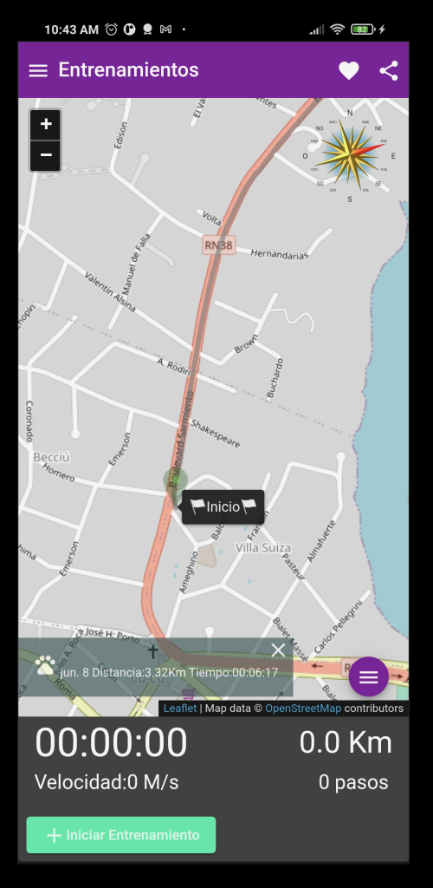
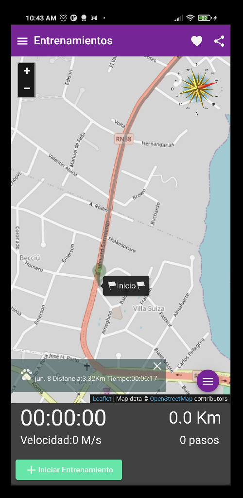

# JMaps ("Mis Prácticas")

"Mis Actividades" es una Aplicación para registrar tus actividades físicas tales como caminar, corres, bici, remar, etc. Donde luego podrás visualizar en el mapa y reutilizar la ruta para mejorar tu tiempo.

by [Juan F. Calvo](calvoj@gmail.com)

This project was generated with [Angular CLI](https://github.com/angular/angular-cli) version 11.2.8.

## Requirements 
Npm 6.14 [NPM](https://www.npmjs.com/get-npm)   
Angular CLI [Angular CLI](https://github.com/angular/angular-cli) version 11.2.8.   
Cordova [Cordova](https://cordova.apache.org/#getstarted) version 10.0.0    
Android Studio  [Android Studio](https://developer.android.com/studio)  
openjdk version "1.8.0_292" 

`android-minSdkVersion 24`  
`android-targetSdkVersion 30`   

## Development Build

Run `npm install`    
Run `ng build`  
Run `./rm_add_android`  
Run `cordova run android`   

## Build Release

Run `./release_compile` to build the project.

